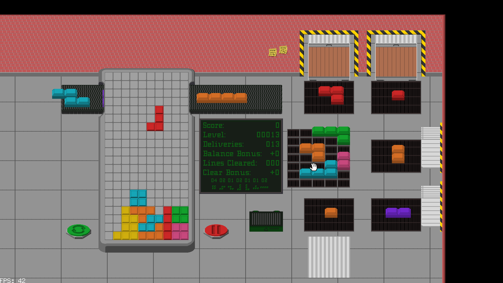
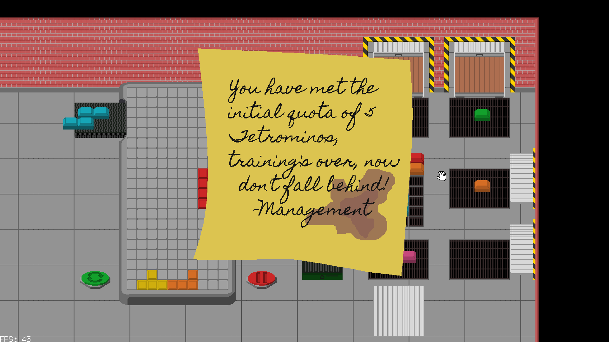

# Overtime at the Tetromino Factory

This is an [entry](https://ldj.am/$343105) for the [Ludum Dare 53](https://ldjam.com/) game jam. The theme: **Delivery**

The gaming industry has made some cuts recently, and in order to play the latest exciting game, you must put in some work.

Hundreds of individual blocks are being delivered to the Tetromino factory, and you must construct the Tetrominos and deliver them to the playing field.

Use the mouse to contruct tetrominos on the factory floor. Only shapes with four blocks can be put on the conveyor belt. If you make one too big, you'll have to throw it in the trash.

The controls for the block falling game are:

* **A** to move the block left
* **D** to move the block right
* **S** to send the block down
* **W** to rotate the block
* **Escape** to pause
* **F5** to toggle fullscreen

See if you can find all the sticky notes left by Management.

## Links:

* [Github Page](https://github.com/timsims1717/ludum-dare-53)
* [itch.io Page](https://thetimsims.itch.io/overtime-at-the-tetromino-factory)

## Resources

* [Pixel Library](https://github.com/faiface/pixel)
* [Beep Library](https://github.com/faiface/beep)
* [Aseprite](https://aseprite.itch.io/)